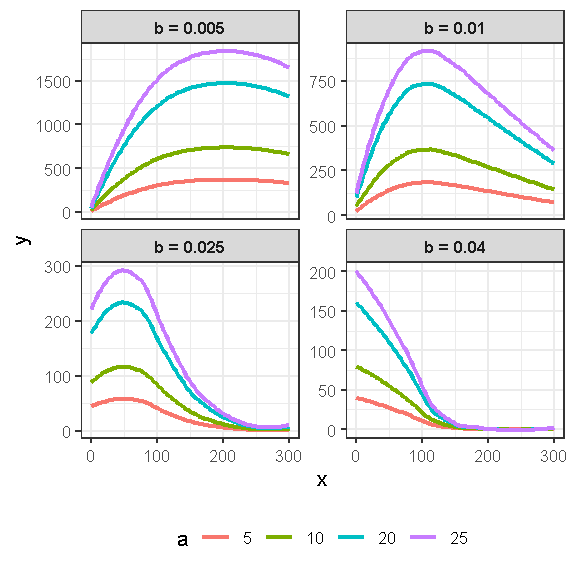

```{r}
library(tidyverse)
library(ggplot2)
library(readr)
library(broom)
library(readr)
powerlift <- read_csv("openpl_sample_female.csv")

```

Powerlifting is a strength sport where participants compete to lift the
heaviest weight. Competitors compete within weight classes, so their
opponents are around the same weight as them. The sport consists of
three different lifts: Squat, Bench, and Deadlift. Squat lifts require
lifters to squat so that their hips are below their knees and lift the
weight to a specific depth. Bench lifts are done while the lifter is
lying on a bench. Bench lifters start with the bar weight being held in
the air and must lower the bar down to their body. Once the bar touches
their body, lifters wait for the command to lift the bar back into the
air with their elbows fully extended. Deadlifting, like squats, start
with the lifter standing up. The lifter must lift the bar off the ground
and get into the position where their shoulders are back and knees are
locked. Competitors are overseen by three judges who determine whether
the lift follows the rules of the events. If a judge believes the lifter
followed the rules, they will turn on a white light. In order for a lift
to count, competitors must receive at least two white lights.

The Powerlifting dataset features data from individual lifters during
their most recent competitions. Variables include characteristics such
as sex, age, birth year and age classes, and division. Other variables
include 3 types of weightlifting: squats, benches, and deadlifts.The
relevant variables for this specific module are Age and Deadlift.

For the sake of this module, the data set was tidied so that it only
included the event "SBD" (Squat, Bench, Deadlift) and two types of
equipment use: Raw, meaning no equipment except knee sleeves, and
Single-ply, which is a single layer suit. The data was also tided to
exclude any lifter that did not finish the competition or had missing
information for key variables like Age.

For this worksheet, the data has been updated to only include female
competitors to use Age as predictors for Deadlift.

1 - Graph a scatterplot of Deadlift amount versus age. Add a smoother.
Comment on the trend you see.

```{r}
ggplot(data = powerlift, aes(x = Age, y = Deadlift)) +
  geom_point() +
  geom_smooth(color = "blue", se = FALSE)
```

**There is a clear non-linear trend. Specifically, we see a fast
increase ("growth") in deadlift amount initially, leading to a peak in
deadlift amount around age 25 or so. After that peak, there is a slow,
steady deadline ("decay") in deadlift amount.**

2 - There are often many possible statistical models for any given data
situation. In this activity, we introduce non-linear least squares
regression. XXXXXXX Add a brief description or reference to NLS in
general. XXXXXXX Non-linear regression modeling typically starts by
identifying a reasonable non-linear form for the model. In this case, we
want a model that allows for growth (increasing response value) followed
by decay (decrease in response value). One such function has the
following form

$$y = axe^{-bx}$$

Use the provided figure to summarize how values of the parameters $a$
and $b$ affect this growth-decay curve.



**From the figure, we see that the b parameter seems to control the
peak's location along the x-axis, along with the amount of growth prior
to the peak. Specifically, for the smallest b (b=0.005), the peak is
further along the x-axis, meaning that there is a longer growth period
leading to the peak. For the largest b (b=0.04), the peak is very close
to x=0, meaning that there is very little growth before the peak. The a
parameter seems to control the height of the curve/peak, with larger a
creating a higher peak for a given b.**

3 - When it comes to fitting a non-linear regression model, closed form
solutions (e.g., derivable formulas) do not usually exist and numerical
optimization methods are needed to obtain estimates of the model
parameters. While we will not delve into the specifics of how a
numerical optimization algorithm works, most algorithms require the user
to specify "initial values" to start the optimization. These initial values can be thought of a guesses about what the model parameters might be. These guesses do not need to be perfect, but if the guesses are "bad," it might take the algorithm longer to find the optimal parameter estimates.

Use this R chunk to define the form of our growth-decay curve.

```{r}
# Define growth-decay curve

growth_decay_curve1 <- function(x, a, b) {
  a * x * exp(-b * x)}

```

Use 

```{r}
ggplot(powerlift, aes(x = Age)) +
  geom_point(aes(y = Deadlift), 
             alpha = 0.3, color = "gray40") +
  geom_smooth(aes(y = Deadlift), color = "blue", fill = "blue") +
  geom_function(fun = function(x) {(15)*(x)*exp((-0.04)*(x))} ,color="red") +
 labs(title = "Fitted shifted Gamma Curve to Deadlift vs. Age",
   x = "Age",
   y = "Deadlift (kg)") +
 theme_minimal()
``` 

A potential way to fix this would be to transform the data itself, but
another approach is to use a different function to fit the model. One
option is a gamma function. A gamma distribution , and includes 3
parameters that impact its shape/scale. In the function below, these
parameters are defined as a(a scaling parameter), b(a rate parameter),
and x_start(which is calculated using x and x0, where x is the specific
observation’s age and x0 is a minimum age threshold). Note: the pmax()
function in the x-start calculation ensures that x_start is not a
negative value, so the model does not become undefined.

a)  Fit a nonlinear least squares model using the shifted gamma function
    provided below:

```{r}
### OLD
shifted_gamma <- function(x, a, b, x0) {
  x_start <- pmax(x - x0, 0)
  a * x_start * exp(-b * x_start)}

```

\*\* For the initial model, use a = 300, b = 0.05, and x0 = 10. 300
represents a scaling factor for the maximum deadlift strength (we can
see that 300 looks to be about the max weight), 0.05 represents the slow
changes in performance, and 10 is an estimate for the minimum age in the
dataset.


```{r}
#nls_fit <- nls(Deadlift ~ shifted_gamma(Age, a, b, x0),
# data = powerlift,
# start = list(a = 300, b = 0.05, x0 = 10))

nls_fit <- nls(Deadlift ~ growth_decay_curve1(Age, a, b),
 data = powerlift,
 start = list(a = 15, b = 0.05))
nls_fit
```

This is the model you should get:
$$Deadlift = (13.10023)(age - 2.25517)e^{((0.03421)(age - 2.25517))}$$
In its final form, this model will use age to model how strength
progresses, with the deadlift increasing as age increases. The rate of
increase will slow due to the exponential decay factor. As people age,
the exponential decay term reduces the growth of the deadlift. The older
someone gets, the less their deadlift will increase. This can be modeled
when graphed...

b)  Add predicted values to your dataset

```{r}
powerlift$pred <- predict(nls_fit)
```

c)  Plot a scatterplot of Actual vs Predicted using a smoother for
    Best3DeadliftKg and with a prediction line

```{r}
ggplot(powerlift, aes(x = Age)) +
  geom_point(aes(y = Deadlift), 
             alpha = 0.3, color = "gray40") +
  geom_smooth(aes(y = Deadlift), color = "blue", fill = "blue") +
  #geom_function(fun = function(x) {(12.74899)*(x - 3.23262)*exp((-0.03306)*(x - 3.23262))} ,color="red") +
  geom_function(fun = function(x) {(10.8)*x*exp((-0.029)*x)} ,color="red") +
  #geom_line(aes(y = pred), color = "red", linewidth = 1.2) +
 labs(title = "Fitted shifted Gamma Curve to Deadlift vs. Age",
   x = "Age",
   y = "Deadlift (kg)") +
 theme_minimal()
```

d)  For this particular equation the maximum age for peak deadlift is
    33.55. If you have taken calculus, derive $$(x-x0)e^{(-b(x-x0))}$$
    to model this using the values given in part a (plug in values and
    solve equation)

We will use z = x-c to simplify solving

$$ze^{-bz}$$ $$z(e^{-bz}) + (e^{-bz})$$ $$e^{-bz} (-zb + 1) = 0$$ What
is in the () is what needs to equal 0 so we can drop $$e^{-bz}$$
$$-zb + 1 = 0 \text{ which equals } z = 1/b$$ Since z = x - x0 the
updated formula is $$x - x0 = 1/b \text{ where } x = x0 + 1/b$$ Plug in
values and get: $$x = 2.25517 +(1/0.03421) = 31.49 $$

e)  Use boot strap to calculate a 95% confidence interval for age where
    the peak occurs (x = 31.49 on the original dataset). Interpret your
    results. Is this consistent with what you found in part d?

```{r}
values <- coef(nls_fit)
x_max <- values["x0"] + 1/values["b"]
```

```{r}
# Step 0. Set up objects 
B <- 1000 # number of bootstrap samples

agePeak_boots <- rep(NA, B) # a blank vector to store the bootstrap statistics

# set up loop
for(i in 1:B){
  # 1. Resample Data
  resampled_data <- powerlift |>
    slice_sample(prop = 1, replace = TRUE)
          
  #2. Calculate statistic
  # Step 1: refit model
  nls_fit_boot <- nls(Best3DeadliftKg ~ shifted_gamma(Age, a, b, x0),
  data = resampled_data,
  start = list(a = 300, b = 0.05, x0 = 10))
  values <- coef(nls_fit_boot)
  x_max_boot <- values["x0"] + 1/values["b"]
    
  #3. Store results
  agePeak_boots[i] <- x_max_boot
} # Back to 1. Resample Data, repeat B times
```

```{r}
#4. Calculate CI
qplot(agePeak_boots)

conf.level <- 0.95
alpha <- 1 - conf.level

quantile(agePeak_boots, probs = c(alpha/2, 1-alpha/2)) |>
  round(2)
```

With 95% confidence, the peak age for max deadlift is between 31.02 and
31.94 years old. Which contains the max value found in part d.

3 -\
Another function possibility is a double exponential function. This type
of function represents a rise and fall. This equation for the
distribution has 4 parameters that impact its shape/scale: A(amplitude
term), k1(rate of decay), k2(rate of growth), x-start (calculated using
x and x_shift, where x is the specific observation’s age, and x_shift is
a minimum age threshold). Again, the pmax() function ensures that
x_start is non-negative.

a)  Fit a nonlinear least squares model using the reparameterized double
    exponential with x_shift provided below

```{r}
double_exp_shift <- function(x, A, k1, k2, x_shift) {
  x_start <- pmax(x - x_shift, 0)
  A * exp(-k1 * x_start) * (1 - exp(-k2 * x_start))}
```

\*\* For the initial model, use A = 300, k1 = 0.02, k2 = 0.1, and
x_shift = 27. 300 represents a scaling factor for the maximum deadlift
strength (we can see that 300 looks to be about the max weight), 0.02
represents the slow decay in performance after the peak, 0.1 represents
the faster increase in performance before the peak, and 27 is an
estimate for the peak that allows for appropriate shifting of ages in
the data set.

```{r}
nls_fit2 <- nls(Best3DeadliftKg ~ double_exp_shift(Age, A, k1, k2, x_shift),
  data = powerlift,
  start = list(A = 300, k1 = 0.02, k2 = 0.1, x_shift = 27))
nls_fit2
```

This is the model you should get:
$$Deadlift = (192.01600)e^{((- 0.01006)(xstart))} * 1- e^{-0.10738 * xstart)}$$
k2 increases significantly, reflecting a growth in deadlift strength
over time. This suggests that the individual’s best 3 deadlift increases
as they age, reaching their peak in their 20s or 30s. k1 starts to lower
the deadlift weight, reflecting the gradual reduction in strength due to
aging where the second term reaches its maximum value and stabilizes.
This can be modeled when graphed...

b)  Add predicted values to your dataset

```{r}
powerlift$pred <- predict(nls_fit2)
```

c)  Plot a scatterplot of Actual vs Predicted using a smoother for
    Best3DeadliftKg and with a line of best fit

```{r}
ggplot(powerlift, aes(x = Age)) +
  geom_point(aes(y = Best3DeadliftKg), alpha = 0.3, color = "gray40") +
  geom_smooth(aes(y = Best3DeadliftKg), color = "blue", fill = "blue") +
  geom_line(aes(y = pred), color = "darkgreen", linewidth = 1.2) +
  labs(title = "Double Exponential with Explicit shift Parameter",
    subtitle = "Estimated shift location is directly modeled",
    x = "Age",
    y = "Best 3 Deadlift (kg)") +
  theme_minimal()
```

d)  For this particular equation the maximum age for peak deadlift is
    31.21. If you have taken calculus, derive
    $$Ae^{(-k1(x-xshift)} * (1-e^{k2(x-xshift)})$$ to model this using
    the values given in part a (Plug in values to solve equation)

we will use z = x-xshift to simplify solving

$$e^{-k1z} = e^{-(k1 + k2)z}$$ $$-k1e^{-k1z} - (k1 + k2) e^{-k2z}= 0$$
$$e^{-k2z} = k1/k1+k2$$ $$-k2z = ln(k1/k1+k2)$$
$$z = -1/k2ln(k1/k1+k2) $$ replace z with x - xshift...
$$x = (-1/k2) ln(k1/(k1+k2)) + xshift$$ Plug in the values:
$$x = (-1/0.10738)ln(0.01006/(0.01006+0.10738)) + 6.41857 = 29.30$$

e)  Use boot strap to calculate a 95% confidence interval for age where
    the peak occurs (x = 29.30 on the original dataset). Interpret your
    results. Is this consistent with what you found in part d?

```{r}
values2 <- coef(nls_fit2)
x_max2 <- (-1 / values2["k2"]) * log(values2["k1"] / (values2["k1"] + values2["k2"])) + values2["x_shift"]
```

```{r}
# Step 0. Set up objects 
B <- 1000 # number of bootstrap samples

set.seed(1)
agePeak_boots2 <- rep(NA, B) # a blank vector to store the bootstrap statistics

# set up loop
for(i in 1:B){
  # 1. Resample Data
  resampled_data <- powerlift |>
    slice_sample(prop = 1, replace = TRUE)

          
  #2. Calculate statistic
  # Step 1: refit model
  nls_fit_boot2 <- nls(Best3DeadliftKg ~ double_exp_shift(Age, A, k1, k2, x_shift),
  data = resampled_data,
  start = list(A = 300, k1 = 0.02, k2 = 0.1, x_shift = 27))
  values2 <- coef(nls_fit_boot2)
  x_max_boot2 <-  (-1 / values2["k2"]) * log(values2["k1"] / (values2["k1"] + values2["k2"])) + values2["x_shift"]
    
  #3. Store results
  agePeak_boots2[i] <- x_max_boot2
} # Back to 1. Resample Data, repeat B times
```

```{r}
#4. Calculate CI
qplot(agePeak_boots2)

conf.level <- 0.95
alpha <- 1 - conf.level

quantile(agePeak_boots2, probs = c(alpha/2, 1-alpha/2)) |>
  round(2)
```

With 95% confidence, the peak age for max deadlift is between 28.67 and
29.97. Which does contain the max value found in part d.

4 - Compare both models you created. Which one is more useful in
predicting dead lift using age? Report the residual sum-of-squares for
both models

Gamma residual sum-of-squares: 6140683

Reparameterized residual sum-of-squares: 6089091

Reparameterized double exponential with x_shift is more useful since it
has a lower residual sum-of-squares.

5 -

a)  Create a 5th order polynomial regression model predicting Age using
    Best3DeadliftKg

```{r}
dl_finish <- lm(data = powerlift, Best3DeadliftKg ~ poly(Age, 5))
summary(dl_finish)
```

b)  Find the AIC of the model found in part a

```{r}
AIC(dl_finish)
```

c)  Find the AIC for the model you preferred in question 4

```{r}
AIC(nls_fit2)
```

d)  Compare the AIC in part b and c. Which one is better in predicting
    dead lift using age? Report each of the model's AIC

The polynomial model is better as it has a lower AIC

dl_finish AIC: 75785.26 nls_fit2 AIC: 75791.52
