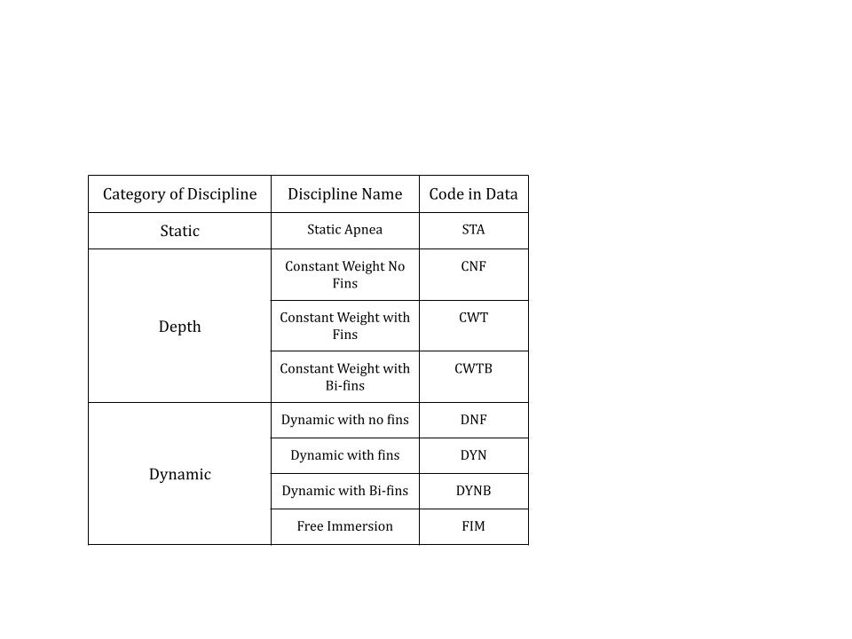

## Motivation

Freediving is a demanding sport that involves a diver being under the water for as long as they can (measured in various ways) with one breath. The central, international organization of this sport under AIDA (International Association for the Development of Apnea) allows for the exploration of intriguing strategies and trends among top competitors.

### Understanding Freediving

All types of freediving involve the diver being under the water for as long as they can with one breath, but from there, the disciplines differ. Most disciplines involve a measurement of distance, but there is also the Static Apnea (STA) discipline in which the diver does not move, just stays under the surface for as long as they can with one breath. The distance disciplines can be split into depth and dynamic distances, which are further split based on the type of equipment a diver is allowed during the dive. This data set includes 7 disciplines besides Static Apnea. To learn more about the disciplines, see the explanation from [AIDA](https://www.aidainternational.org/competitive).

#### Depth

Depth disciplines require the diver descend as deep as they can into the water and ascend on a single breath. These disciplines are performed in open water. The AIDA recognized competition disciplines are constant-weight with fins (CWT), constant-weight with bi-fins (CWTB), constant weight with no fins (CNF), and free immersion (FIM).

#### Dynamic

Dynamic disciplines require the diver to travel horizontally through the water as far as they can on a single breath. These disciplines are performed in a pool. The AIDA recognized dynamic disciplines are dynamic with fins (DYN), dynamic with bi-fins (DYNB), and dynamic with no fins (DNF).

[]

#### Announcing

Divers in all disciplines are required to announce their target performance ahead of their attempt. If they fail to reach their announced target, they will face a point penalty. In dynamic and static disciplines it is common for divers to announce very low targets, so they do not face this penalty. However, in depth disciplines, divers are not allowed to go deeper than their target (for safety reasons), so they must announce strategically.

## Data

Each row in the `freedivingRecords` data set represents a continental (every continent besides Antarctica) record in a diving discipline. All continents have one record in the data set for each of the 8 disciplines. If more than one diver set a particular record, only the diver who set it first is included.

There are 96 records with 8 variables for each.

<b>Variable Descriptions</b>

| Variable    | Description                                               |
|-------------|-----------------------------------------------------------|
| Name        | Diver name (and country)                                  |
| Sex         | Diver sex (Male or Female)                                |
| Discipline  | Discipline of the dive (STA, CNF, DNF, etc.)              |
| Result      | Result of the dive (time or distance)                     |
| Announced   | Diver's announced target for the dive                     |
| Date        | Date of the dive (dd.mm.yyyy)                             |
| Event       | Event (competition) the dive was performed at             |
| Continent   | Continent the athlete represents                          |

**Download Continental Diving Data:** [freedivingRecords.csv](freedivingRecords.csv){target="_blank"}

## Questions

1. Do announcement values seem to differ between static, depth, and dynamic disciplines? Why is this? (do some research)

2. Do some continents seem to outperform others?

3. What are the world records (according to these data) in each discipline?

## References

These data are compiled from [AIDA (International Association for the Development of Apnea)](https://www.aidainternational.org/ContinentalRecords).