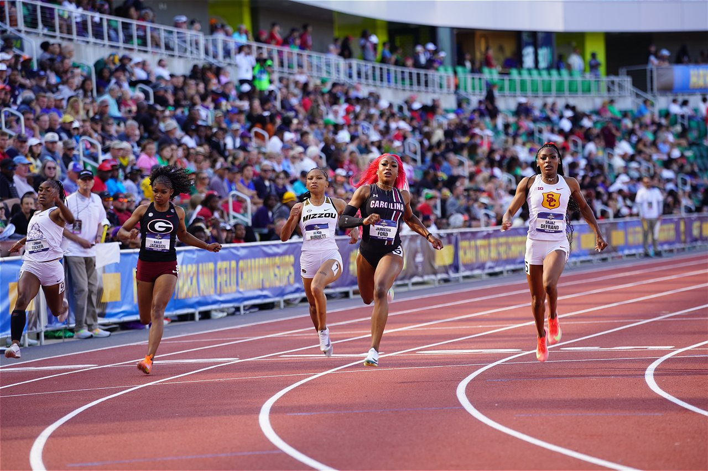

{width=3in}

### Module

Please note that these materials have not yet completed the required pedagogical and industry peer-reviews to become a published module on the SCORE Network. However, instructors are still welcome to use these materials if they are so inclined.

### Introduction

In outdoor track, runners run on a track and compete to complete the distance in the shortest time. There are many different events (distinguished by length, measured in meters) and runners typically have a specialty between distance or sprint. Distance runners need to think about pacing themselves and strategically overtaking competitors. Sprinters need to get a good start and maintain their highest speed for a short period of time. This difference in strategy is represented in the data recorded about runners' performance at high levels. NCAA Women's Division 1 track runners compete at a very high level, and their times are recorded throughout the season to track the top individual achievements.

::: {.callout-note collapse="true" title="Activity Length" appearance="minimal"}
This could be used as an out-of-class homework assignment or an in-class activity that should take 45 minutes or less.
:::

::: {.callout-note collapse="true" title="Learning Objectives" appearance="minimal"}
By the end of this activity, students will:

1.  Apply real life context to understand trends in data
2.  Understand when its appropriate to use a transformation
3.  Be able to apply a transformation to data
:::

::: {.callout-note collapse="true" title="Methods" appearance="minimal"}
Students should have a brief, introductory knowledge of transformations (specifically, what different transformations can be used to fix).
:::

::: {.callout-note collapse="true" title="Technology Requirements" appearance="minimal"}
Students will need to have access to RStudio or another statistics software capable of making graphs and applying a transformation to data.
:::

### Data

This activity uses an edited version of the data set: [NCAA_track](NCAA_track.csv)

Each row in the `NCAA_track.csv` data set represents one of the 50 fastest times in a given event for the 2025 NCAA Women's Division 1 East outdoor track season (with only a runner's fastest time included, no runner is included more than once for a single event). If a time was achieved by more than one runner, each runner will be present, and they will all have the same number in the `Place` column. Each event includes exactly 50 runners, with the exception the 200 meters event, which has two runners tied in 50th place. If a runner had a top 50 time in more than one event, they will have a row in the data set for each event they were in the top 50 for.

This version of the data set contains an extra variable called `Speed` that represents a runner's average speed over an event. It was calculated by dividing `Event` by `Time` and is recorded in meters per second.

There are 351 rows observed over 9 variables.

<b>Variable Descriptions</b>

| Variable    | Description                                             |
|-------------|---------------------------------------------------------|
| Place       | The runner's place for this event                       |
| Athlete     | The runner's name (Last, First)                         |
| Year        | The runner's class year                                 |
| Team        | The team the runner represents                          |
| Time        | The runner's time for this event                        |
| Meet        | The meet the time was achieved at                       |
| Meet.Date   | The date of the meet the time was achieved at           |
| Event       | What event the time is from (how many meters)           |
| Speed       | The runner's speed for the event in m/s (event/time)    |

#### Data Source

The data are compiled from the Track and Field Results Reporting System Website [https://www.tfrrs.org/ncaad1east/outdoortrack/women](https://www.tfrrs.org/ncaad1east/outdoortrack/women){target="_blank"}.

### Materials

[Module Worksheet (R version)](2025_Track_Transformation_worksheet.qmd){target="_blank"}

[Module Worksheet (non-R version)](Track_TransformationModule_worksheet.docx){target="_blank"}

[Solutions to Worksheet (R/Quarto version)](2025_Track_Transformation_SOLUTIONS.qmd){target="_blank"}

[Solutions to Worksheet (pdf)](2025_Track_Transformation_SOLUTIONS.pdf){target="_blank"}

::: {.callout-note collapse="true" title="Conclusion" appearance="minimal"}
Upon conclusion of this module, students will have a greater understanding of data transformations and when they can be useful with regards to linear regression modules.
:::
